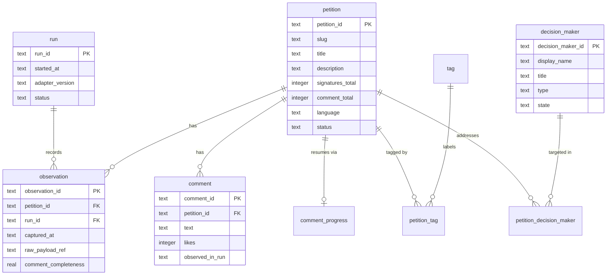

# petitioner documentation

Petitioner collects Change.org petitions and their complete comment sets into a SQLite store with
Parquet/CSV export. It requires no login or API key, and it does no authentication or CAPTCHA
circumvention: on a hard bot block it halts by design.

## Table of Contents

- [Prerequisites](#prerequisites)
- [Installation](#installation)
- [Usage](#usage)
- [Configuration](#configuration)
- [Data model](#data-model)
- [Contributing](#contributing)
- [License](#license)
- [Acknowledgments](#acknowledgments)

## Prerequisites

- Python >= 3.11

## Installation

```bash
pip install petitioner
```

Or, for a checkout of the repository:

```bash
uv sync --extra dev
```

## Usage

```bash
petitioner collect --sitemap --limit 50    # discover + collect from the sitemap
petitioner collect --urls petitions.txt    # collect specific URLs/ids (one per line)
petitioner collect --query "climate"       # keyword filter over sitemap slugs
petitioner export --format both            # write Parquet + CSV to the export dir
petitioner show                            # print the latest-state snapshot as JSON
petitioner show --petition-id 18514354     # print one petition's longitudinal series
```

Each petition record includes its formal decision makers (the targets it is addressed to, such as
politicians), which are written to a `decision_makers` table and exported alongside petitions and
comments.

> **Note:** Keyword discovery is a substring filter over sitemap-enumerated slugs. Change.org's
> on-site full-text search is an Algolia integration gated by bot protection and is not reachable
> from an automated client; the sitemap remains the complete discovery channel.

You are responsible for ensuring your use is authorized under Change.org's terms.

## Configuration

Configuration is file-based and environment-overridable. Set any field with a `PETITIONER_<FIELD>`
environment variable (for example, `PETITIONER_REQUESTS_PER_SECOND=0.5`) or a `.env` file in the
working directory. No credentials are required or accepted.

| Variable                                   | Default         | Description                                    |
| ------------------------------------------ | --------------- | ---------------------------------------------- |
| `PETITIONER_REQUESTS_PER_SECOND`           | `1.0`           | Maximum request rate to the site.              |
| `PETITIONER_JITTER_SECONDS`                | `0.5`           | Additive random delay per request.             |
| `PETITIONER_MAX_RETRIES`                   | `4`             | Retry attempts on transient transport errors.  |
| `PETITIONER_BACKOFF_BASE_SECONDS`          | `1.0`           | Exponential backoff base between retries.       |
| `PETITIONER_PER_DOMAIN_REQUEST_CEILING`    | `10000`         | Hard cap on total requests per run.            |
| `PETITIONER_REQUEST_TIMEOUT_SECONDS`       | `30.0`          | Per-request timeout.                           |
| `PETITIONER_USER_AGENT`                    | desktop Chrome  | User-Agent header sent with every request.     |
| `PETITIONER_DB_PATH`                       | `petitioner.db` | SQLite database path (system of record).       |
| `PETITIONER_RAW_PAYLOAD_DIR`               | `raw_payloads`  | Directory for retained raw GraphQL payloads.   |
| `PETITIONER_EXPORT_DIR`                    | `exports`       | Directory for Parquet/CSV exports.             |
| `PETITIONER_MANIFEST_DIR`                  | `manifests`     | Directory for per-run JSON manifests.          |
| `PETITIONER_LANGUAGE_ALLOWLIST`            | `("en",)`       | Languages retained during collection.          |
| `PETITIONER_EXCLUDE_NON_ALLOWED_LANGUAGES` | `true`          | Drop petitions outside the allowlist.          |
| `PETITIONER_LOG_LEVEL`                     | `INFO`          | Log level (`DEBUG`, `INFO`, `WARNING`, ...).    |

## Data model

Collection writes to a SQLite database using snapshot-latest semantics: entities upsert by id, while
each fetch appends an immutable `observation` referencing the raw payload retained on disk.



## Contributing

Contributions are welcome. See [CONTRIBUTING.md](CONTRIBUTING.md) for the development setup and the
pull-request process, and [CODE_OF_CONDUCT.md](CODE_OF_CONDUCT.md) for community expectations. In
short:

```bash
uv sync --extra dev
uv run ruff check . && uv run mypy src && uv run pytest tests/
```

## License

Released under the MIT License. See [LICENSE](LICENSE).

## Acknowledgments

Built with [httpx](https://www.python-httpx.org/), [pydantic](https://docs.pydantic.dev/),
[polars](https://pola.rs/), [click](https://click.palletsprojects.com/),
[structlog](https://www.structlog.org/), [tenacity](https://tenacity.readthedocs.io/), and
[lingua](https://github.com/pemistahl/lingua-py).
